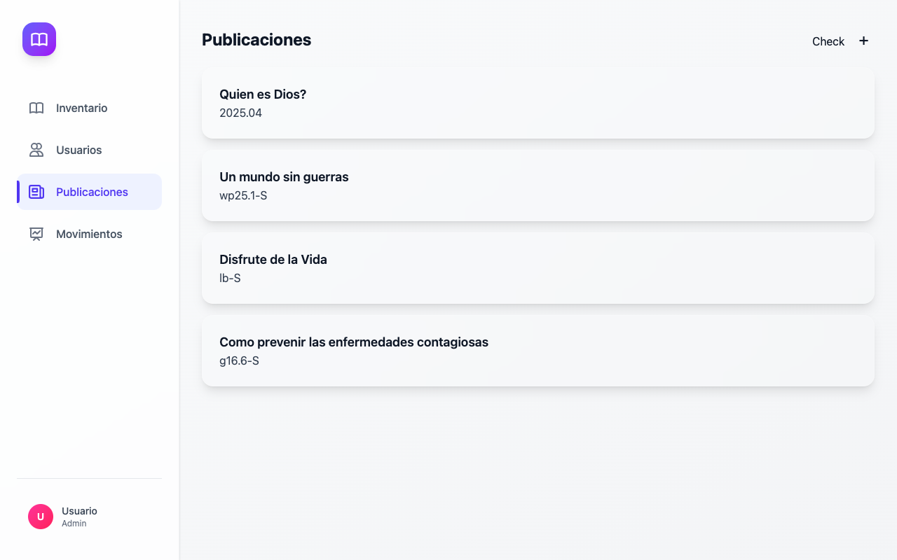
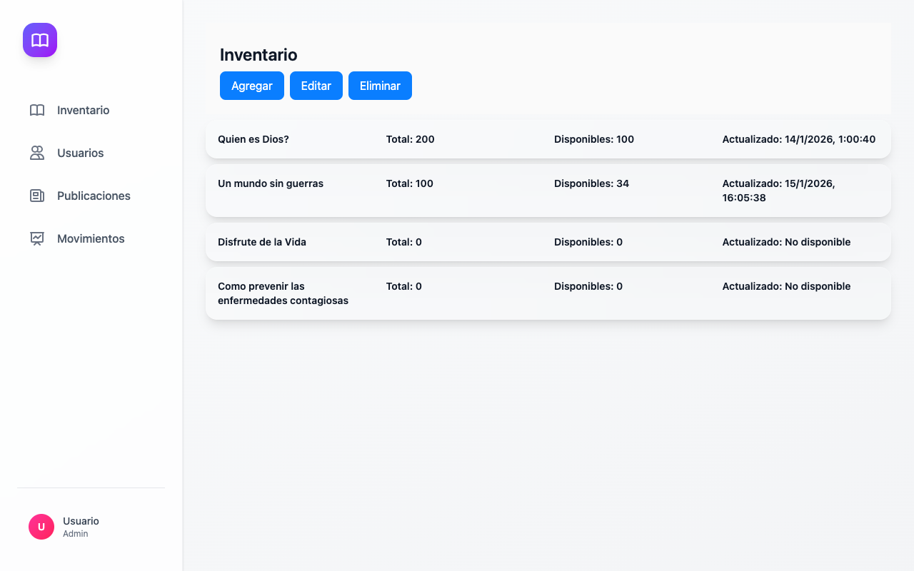
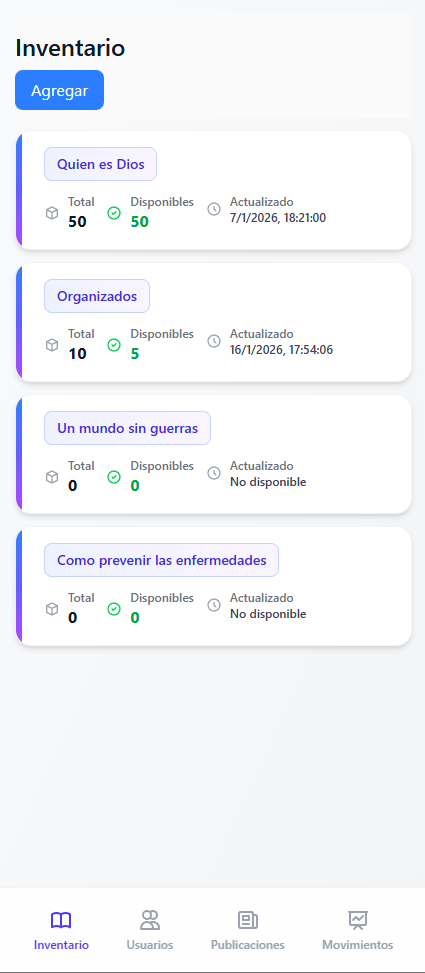

# Library App UI

A modern, professional desktop application for managing library publications and inventory built with Electron.

## 🎨 User Interface

### Desktop Interface

#### Publications View


The publications view provides a comprehensive overview of all available publications in the library system with a clean, modern interface.

#### Inventory Management


Manage your library inventory with an intuitive interface that displays total quantity, available items, and last update timestamps for each publication.

### Mobile Responsive Design



The application features a responsive design that adapts seamlessly to different screen sizes, ensuring a consistent experience across devices.

## ✨ Features

- **📚 Publications Management** - Browse and manage library publications
- **📦 Inventory Tracking** - Monitor stock levels and availability
- **👥 User Management** - Handle library users and permissions
- **📊 Movement Records** - Track inventory movements and transactions
- **🎯 Modern UI** - Clean, professional interface with smooth animations
- **🔄 Real-time Updates** - Dynamic content updates without page refreshes

## 🛠️ Technology Stack

- **Frontend**: HTML, CSS (Utility-first), JavaScript
- **Framework**: Electron
- **Backend API**: FastAPI (Python)
- **HTTP Client**: Axios

## 🚀 Getting Started

### Prerequisites

- Node.js (v14 or higher)
- Python 3.8+ (for backend)
- npm or yarn

### Installation

1. Clone the repository
2. Install dependencies:
   ```bash
   npm install
   ```

3. Start the application:
   ```bash
   npm start
   ```

## 📱 Application Views

- **Publications** - View and manage all publications
- **Inventory** - Track inventory levels and availability
- **Users** - Manage library users
- **Movements** - Monitor inventory transactions

## 🎯 Design Principles

- **Modern & Clean** - Professional gradients, shadows, and rounded corners
- **Responsive** - Adapts to different screen sizes
- **Accessible** - Keyboard navigation and focus indicators
- **Intuitive** - Clear visual hierarchy and user flows

---

Built with ❤️ for modern library management
