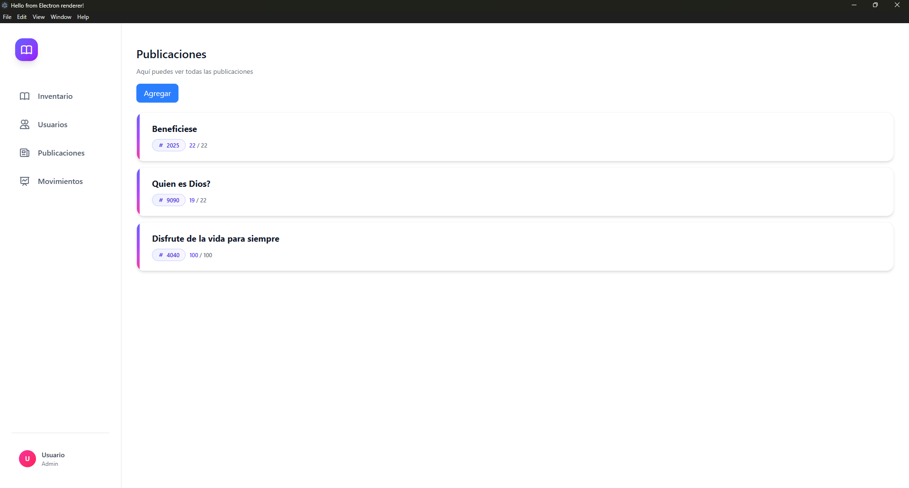
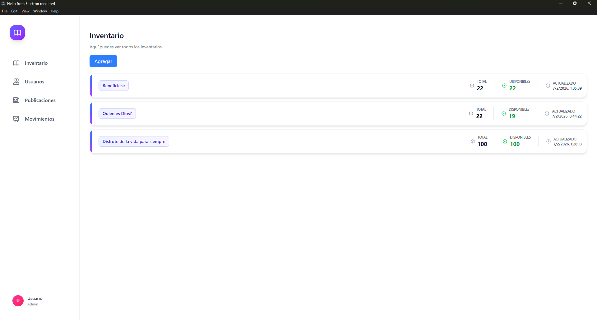
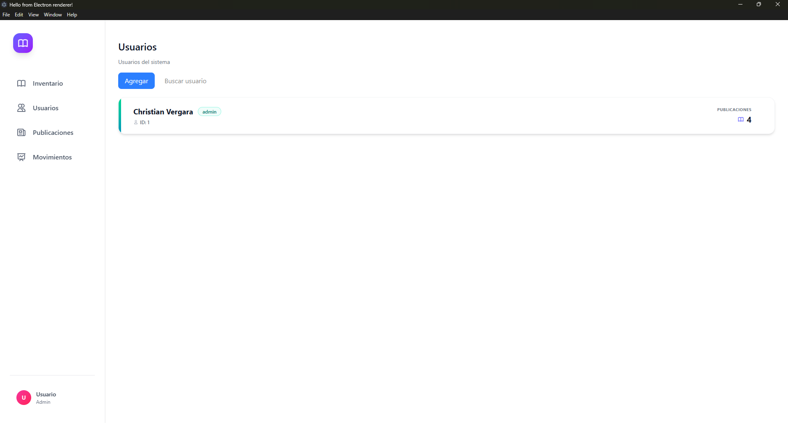
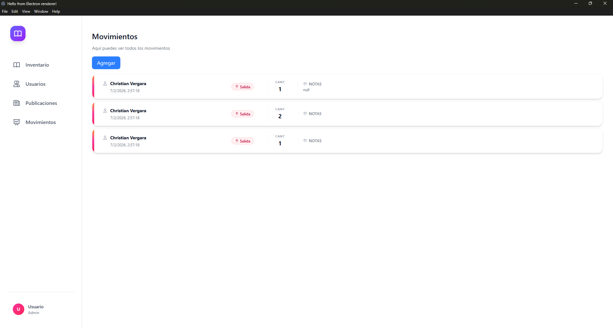
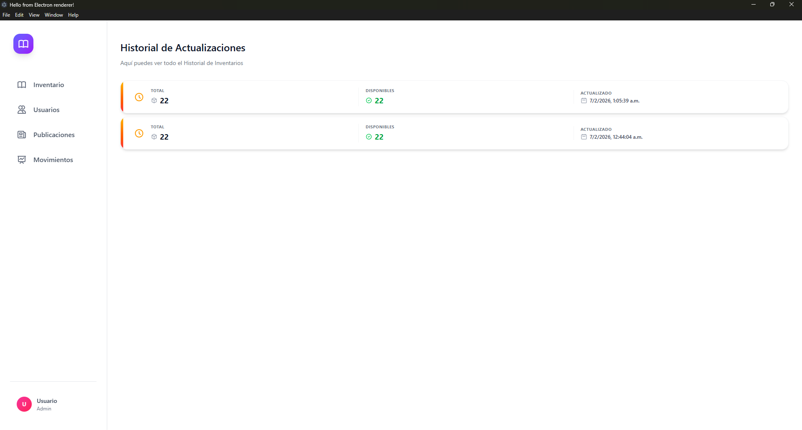

# Alejandria UI

Aplicacion profesional para la gestion de bibliotecas.

## Tech Stack

- **Frontend**: HTML, CSS (Utility-first), JavaScript
- **Framework**: Electron
- **HTTP Client**: Axios


## UI / UX 

### Publicaciones


Gestiona publicaciones por titulo, año, codigo

### Inventario


Gestiona el inventario de cada publicacion creada asi como su historial de actualizaciones 

### Usuarios


Gestiona los usuarios de la biblioteca los usuario podran ser creados por el administrador y podran ser eliminados por el administrador, cada usuario podra solicitar salida de publicaciones y quedara registrado el movimiento ademas de cuantos ejemplares obtuvo y la fecha de salida 

### Movimientos


Gestiona los movimientos y registros de salida de publicaciones de los usuarios

### Historial


Gestiona el historial de actualizaciones del inventario de cada publicacion

## Ejecutar la aplicacion
1. Instala dependencias usando npm
```bash
npm install
```
2. Compila los estilos css
```bash
npm run buildcss
```
3. Ejecuta la aplicacion
```bash
npm run start
```

La aplicacion llama a la API de Alejandria en localhost puerto 8000 para obtener los datos, la API se encuentra en el repositorio junto con la documentacion en el repositorio [Alejandria API](https://github.com/Christianymoon/Alejandria)